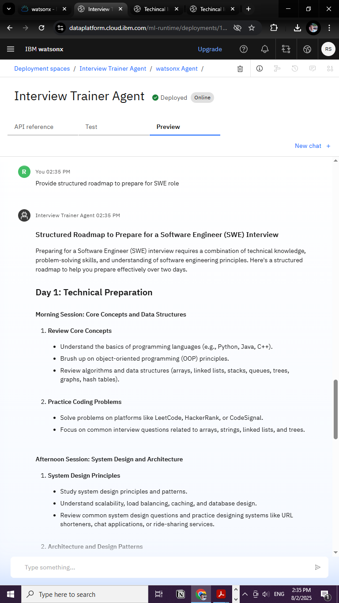

# 💼 AI Interview Trainer Agent (RAG-based, IBM watsonx)

## 📌 Problem Statement

Job seekers often face difficulty in preparing effectively for interviews due to a lack of structured, personalized guidance. The core challenge is to assist candidates using an intelligent tool that provides targeted preparation strategies based on their **profile name**, **experience level**, and **job role**.

This project introduces an AI-powered **Interview Trainer Agent**, built using **Retrieval-Augmented Generation (RAG)**. It generates tailored interview question sets, industry-specific expectations, behavioral scenarios, and HR guidelines using a curated knowledge base. The user can input a **resume** or **job title**, and the system returns role-specific questions, model answers, and improvement tips — covering both technical and soft skills — to help users build confidence and improve their chances in competitive interviews.

---

## 🚀 Proposed System / Solution

The solution is a **conversational AI agent**, hosted on **IBM watsonx**, designed to act as a personal interview coach.

### Key Features:
- 📄 Accepts job titles or resumes.
- 🧠 Provides role-specific interview questions and structured preparation roadmaps.
- 🎯 Covers technical questions, behavioral scenarios, and company-specific research tips.
- 💬 Built using **Large Language Models (LLMs)** grounded with a **custom knowledge base** for high relevance.

This makes the agent capable of giving **context-aware**, **personalized** preparation advice.

---

## ⚙️ System Development Approach

### 🔧 Technology Stack:

| Component               | Technology                                      |
|------------------------|--------------------------------------------------|
| ☁️ Cloud Platform       | IBM Cloud Lite                                   |
| 🧠 AI Hub               | IBM watsonx.ai                                   |
| 🛠️ Agent Framework      | IBM watsonx Agent Lab (Beta)                      |
| 🔍 LLMs Used            | `mistral-large`          |
| 🧠 Architecture         | ReAct (Reason + Act) + Retrieval-Augmented Generation |
| 🗃️ Knowledge Base Format | `Interview Qna Plaintext.docx`                  |

---

## 🧮 Algorithm and Workflow

### Retrieval-Augmented Generation (RAG):

1. **Vectorization**: The uploaded `.docx` file is chunked and converted to vector embeddings using watsonx.
2. **Retrieval**: A user query is vectorized and compared with the KB to retrieve the top relevant chunks.
3. **Augmentation**: These relevant chunks are prepended to the user query to create an **augmented prompt**.
4. **Generation**: The augmented prompt is passed to the LLM (e.g., `mistral-large`) to generate a detailed, context-rich response.

---

## 🧪 Deployment

- Built within **IBM watsonx Agent Lab**.
- Deployed using the **"Deploy"** feature.
- Available as a **web chatbot** or **API endpoint**.
- Can be embedded in web apps, mobile platforms, or third-party tools.

---

## ✅ Example Output

> 📷 *Response to: “Roadmap to Prepare for SWE Role in Google within 2 Days”*

This demonstrates the agent’s ability to generate actionable, detailed interview prep steps specific to job roles.

---

## 📘 Conclusion

This project successfully showcases how a **Retrieval-Augmented Generation (RAG)** architecture, powered by LLMs and hosted on **IBM watsonx**, can create a personalized and intelligent **Interview Trainer Agent**.

It addresses the core problem of unstructured interview prep by providing tailored, accurate, and comprehensive guidance to candidates — increasing their chances of success.

---

## 🔮 Future Scope

- 🎤 **Mock Interview Mode**: Turn-by-turn conversations with evaluation and feedback.
- 📄 **Resume Parsing**: Automatically extract skills and experience from uploaded resumes.
- 🌐 **Live Knowledge Base**: Integrate APIs for dynamic question sourcing (e.g., Glassdoor, LinkedIn).
- 📊 **Progress Tracking**: Save and analyze user responses over time to track improvements.

---

## 🔗 References

- [IBM watsonx.ai Documentation](https://cloud.ibm.com/docs/watsonx)
- [IBM Cloud Lite](https://cloud.ibm.com/registration/lite)

